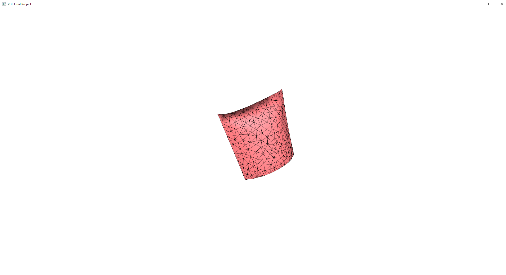

[TOC]

# LYRA

## Attention

__lyra is research project in our lab. Please do not distribute any source code in website.__

## Introduction

lyra is thin shell simulator name we give our program which solve PDE of deformable object by FEM in space and FDM in time. lyra provide large time step physical simulation by backward Euler. For evaluating internal force, specially, stretch force and shear force in plane and bending force out of plane, FEM is necessary numerical tool. Moreover, lyra provide simple external force implementation such as gravity, wind and point group constraint for generating interesting results. Unfortunately, robust thin shell simulator with collision dectection and response is a hard and burdensome task, we don't implement those important and impressive traits in the simple simulator.

## Dependencies

* __Eigen3__
* __Jsoncpp__
* __Alglib__
* __OpenGL(glfw3 glew)__
* __Stb_image__
* __Boost(system filesystem)__
* __OpenPNG__
* __OpenMP*(Optinal)__

## Compile and Run

__ATTENTIONS: YOU MUST USE COMPLIER SUPPROTING C++ 14.such as visual studio 2015 or g++ 3.5 above.__

We code lyra with `visual studio 2019 community` and provide a simple batch processing script `AutoRun.sh` in root dictionary for install dependencies and run demo in linux. Moreover, you can run program `./Lyra.a conf.json` in root dictionary. When lyra is running, you can adjust
camera, Concrately,

* `W` __move camera forward__
* `S` __move camera back__
* `A` __move camera left__
* `D` __move camera right__
* `ESC` __exit lyra__
* `Long press the left mouse button and move` __adjust camera direction__

## Usage

If you successfully compile lyra, you can toy lyra with simulator configration file `conf.json` in `./conf/` subdictionary by tuning parameters in
the configration file. Configration file follow simple json format and provide few parameters to change.There is comment in detail for use `conf.json`:
```json
{
	//time step for simulator
    "frame_time": 0.04,  
    //sub time step for stable simulation
    "frame_steps": 8,	
    // total running time
    "end_time": 15,		
    //cloth info
    "cloths": [{
    //cloth mesh,ATTENTION:NOT SUPPORT ARBITRAY MESH,PLEASE USE MESH IN meshes subdictionary		
        "mesh": "meshes/squarerefined.obj",
    //mesh transform	
        "transform": {"translate": [-0.5, -1, 0.5]},
    //data from cloth material database of data-driven elastic models for cloth acquired by Huamin Wang,Ravi Ramamoorthi,and James O'Brien
    //damping is stiffness factor for damping force
        "materials": [{"data": "materials/gray-interlock.json",
            "damping": 0.03],
    //texture is optinal and you can change any texture you like
        "texture":"textures/rainbow.jpg"
    }],
    //mesh handle
    "handles": [
    //pin points index in cloth
    {"nodes": [2,3],
    //motion is optinal for indicating handle motion 
    "motion":0,
    //end_time is optinal for setting handle time
    "end_time":7}],
    //motion is optinal for setting motion trajectory
    "motions": [[
    //time specify start time of motion
    //transform specify transform
        {"time": 1, "transform": {"rotate": [0,0,0,1]}},
        {"time": 2, "transform": {"rotate": [-45,0,0,1]}},
        {"time": 2.5, "transform": {"rotate": [-90,0,0,1]}},
        {"time": 3, "transform": {"rotate": [-135,0,0,1]}},
        {"time": 3.5, "transform": {"rotate": [-180,0,0,1]}},
        {"time": 4, "transform": {"rotate": [-225,0,0,1]}},
        {"time": 4.5, "transform": {"rotate": [-270,0,0,1]}},
        {"time": 5, "transform": {"rotate": [-315,0,0,1]}},
        {"time": 6, "transform": {"rotate": [-360,0,0,1]}}
    ]],
    //speed of gravity
    "gravity": [0, 0, -9.8],
    //wind is optinal.
    "wind":{
    	//wind density
    	"density":1,
    	//wind velocity
    	"velocity":[0,3,0],
    	//wind drag
    	"drag":1}
}

```

## Result ScreenShot




## Code Hierarchy

Hierarchy of lyra is simple. The program is divided into two parts: `Render` which visualize simulation results and `Simulator` which simulate
unstructed mesh data by FEM and FDM. `Render` is simple OpenGL wrapper includes necessary visualized components: __camera__,__data buffer__,__window handle__, __shader__ and __texture handle__ etc.Some computer graphic knowledge is necessary for having a good grasp of `Render`.

Except packaging configuration file parser, `Simulator` implements simulation core of lyra in `physic.hpp` and `physic.cpp`, specially, `stretching_force` and `bending_force` functions, for every finite element in mesh, both of functions calculate small stiffness matrix and combine them into a large one. 
next, in `ObtainImplicitEquation`, `Simulator` solve large linear system using wrappered mature linear system solver. This core loop implement in
`PhysicStep` which is a member function of `Simulator`. 

## Acknowledgement

Although lyra is a simple thin shell simulator far too from praticle apllication, It is not a easy task to implementing it from scratch using C++. we draw lessons from some excellent open source code such as [opencloth](https://github.com/mmmovania/opencloth), [Argus](https://github.com/lijieumn/argus-distribution) etc. For solving linear system, we reuse packaging eigen solver and fundamental data structure(vector,matrix and transformation etc) from [Argus](https://github.com/lijieumn/argus-distribution).For thin shell motion parser we reuse motion parser from [opencloth](https://github.com/mmmovania/opencloth).


